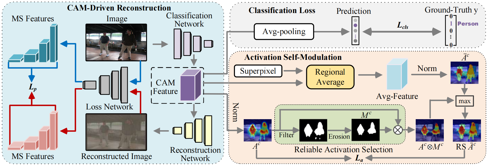

# Spatial Structure Constraints for Weakly Supervised Semantic Segmentation


Introduction
------------
This is the source code for our paper **Spatial Structure Constraints for Weakly Supervised Semantic Segmentation**

Network Architecture
--------------------
The architecture of our proposed approach is as follows


## Installation

* Install PyTorch 1.7 with Python 3 and CUDA 11.3

* Clone this repo
```
git clone https://github.com/NUST-Machine-Intelligence-Laboratory/SSC.git
```

### Download PASCAL VOC 2012 

* Download [PASCAL VOC 2012](http://host.robots.ox.ac.uk/pascal/VOC/voc2012/#devkit)
* Download [Superpixel](https://wsss-ssc.oss-cn-shanghai.aliyuncs.com/voc_superpixels.zip)


## Testing the segmentation results with our pretrained model directly

#### Prerequisite for the segmentation task
* Install Python 3.8, PyTorch 1.11.0, and more in requirements.txt

* Download ImageNet pretrained [model](https://download.pytorch.org/models/resnet101-cd907fc2.pth) of DeeplabV2 from [pytorch](https://pytorch.org/) . Rename the downloaded pth as "resnet-101_v2.pth" and put it into the directory './data/model_zoo/'. (This step is just to avoid directory related error.)


* Download our generated pseudo label [sem_seg](https://wsss-ssc.oss-cn-shanghai.aliyuncs.com/sem_seg.zip) and put it into the directory './data/'.  (This step is just to avoid directory related error.)

* Download our pretrained checkpoint [best_ckpt.pth](https://wsss-ssc.oss-cn-shanghai.aliyuncs.com/best_ckpt.pth) and put it into the directory './segmentation/'.  Test the segmentation network (you need to install CRF python library (pydensecrf) if you want to test with the CRF post-processing)


```
cd segmentation
pip install -r requirements.txt 

python main.py --test --logging_tag seg_result --ckpt best_ckpt.pth
python test.py --crf --logits_dir ./data/logging/seg_result/logits_msc --mode "val"
```


## Training the pseudo label generation network

* Run run_sample.py (You can either mannually edit the file, or specify commandline arguments.) and gen_mask.py to obtain the pseudo-labels and confidence masks (put them into the directory './segmentation/data/' ). Our generated ones can also be downloaded from [sem_seg](https://wsss-ssc.oss-cn-shanghai.aliyuncs.com/sem_seg.zip) and [mask_irn](https://wsss-ssc.oss-cn-shanghai.aliyuncs.com/mask_irn.zip) .
```
python run_sample.py
python gen_mask.py
```

## Training the segmentation network


#### Prepare the data directory
* Put the data and pretrained model in the corresponding directories like:
```
data/
    --- VOC2012/
        --- Annotations/
        --- ImageSet/
        --- JPEGImages/
        --- SegmentationClass/
        --- ...
    --- sem_seg/
        --- ****.png
        --- ****.png
    --- mask_irn/
        --- ****.png
        --- ****.png
    --- model_zoo/
        --- resnet-101_v2.pth
    --- logging/
```


* Train the segmentation network
```
cd segmentation
python main.py -dist --logging_tag seg_result --amp
```


